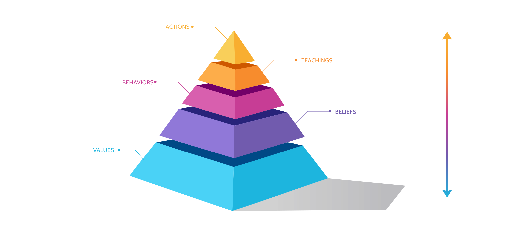
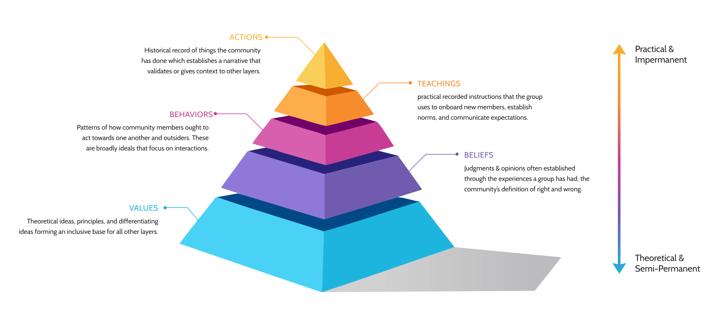

How often do you stop to consider the organizational cultures that surround you? Many of us talk about the importance of "healthy" workplace culture, and a few of us dedicate time and energy to cultivating what we hope are healthy cultures. But do you know your impact or the impact the culture is having on you?

When you encounter a new community, it's often not apparent what kind of culture they have. You may wonder, what would it be like to be part of this community? Even within our existing communities, we often struggle to communicate the cultural norms, why they're important, or how they've become the norm.

In this post, I share my framework for defining organizational culture. I worked with peers and used this framework to navigate defining the culture in our workplace. I suspect it may be helpful to others seeking to understand and express their organizational cultures.

Having a clear definition of your organizational culture is incredibly helpful for new and existing community members. When you're interviewing with a company, for instance, you likely feel uncertain about their culture and wonder what you might experience as a member of that organization. If the organization understands its culture, it will share specifics and regularly reflect on its definitions to recognize shifts and evolutions.

## The Framework

I suggest we define organizational culture in five parts arranged on a spectrum from theoretical ideas to practical actions. These parts are Values, Beliefs, Behaviors, Teachings, and Actions.

I have organized these parts into layers on a pyramid where Values establish a broad base uniting people around shared principles and ideals. Actions are at the top of the pyramid as the observable events, which are examples of the other layers in action.

<em>Pyramid Illustration by [Danny Sapio](https://www.dannysapio.com/)</em>

<small>Pyramid Design by [Danny Sapio](https://www.dannysapio.com/)</small>

Lower layers of the pyramid establish theoretical and semi-permanent concepts. Lower layers change and evolve only occasionally as a community adjusts in the upper layers, evolving shared understandings.

The upper layers of the pyramid are constantly iterating with every event and action the community lives out. There is an upward pressure from semi-permanent lower layers; they establish broad criteria for the impermanent upper layers.

There is also a downward pressure from the upper layers, which causes a change in lower layers with less and less influence over the lowest layers.

As a community's observable actions change over time, so do their Teachings, Behaviors, Beliefs, and Values (the lowest layer) to a minimal degree. Actions don't drive the changes in every other layer. Still, often cultural shifts are observed as a change in actions eventually reflected in official teachings, behaviors, etc.

## The layers

These are simple descriptions for each layer; use them to clarify relationships but not drive separations; your definition should feel harmonious.

- **Values** are theoretical ideas, principles, and differentiating ideas forming an inclusive base for all other layers.
- **Beliefs** are judgments & opinions, often established through the experiences a group has had. Beliefs are the community's definition of right and wrong.
- **Behaviors** are patterns of how community members ought to act towards one another and outsiders. These are broadly ideals that focus on interactions.
- **Teachings** are practical recorded instructions that the group uses to onboard new members, establish norms, and communicate expectations.
- **Actions** are the historical record of things the community has done, starting with the most recent actions and going backward in time to establish a narrative that validates or gives context to other layers.

I hope you can identify the right questions and ideas to consider when defining organizational culture with this framework. You may arrive at a definition through empirical observation that eventually matures into systems thinking[¹](https://medium.com/workmatters/1-2-3-ideas-on-systems-thinking-stocks-and-flows-feedback-loops-and-leverage-points-d0703f08f958). Once you have your first draft, you may be surprised at how it clarifies the unspoken and reframes your assumptions.

This framework lags reality; it's a helpful tool for capturing what is true at one time but must be regularly updated to remain accurate. The exercise of maintenance in and of itself is valuable as it requires you to be transparent and **challenges you to consider if the culture you have is the culture that you and the community want.**

## Additional Reading

For more on this subject, check out these thought-provoking resources.

- Edgar Schein's [model of organizational culture](https://en.wikipedia.org/wiki/Edgar_Schein)
- The [Organizational Culture Inventory (OCI)](https://www.humansynergistics.com/docs/default-source/default-document-library/oci_product_info_sheet_v3-1_np.pdf) from Human Synergistics International
- [Givers take all: The hidden dimension of corporate culture](https://www.mckinsey.com/business-functions/organization/our-insights/givers-take-all-the-hidden-dimension-of-corporate-culture) by McKinsey & Company
- Donella (Dana) Meadows' seminal book: [Thinking in Systems: A Primer](https://www.amazon.com/Thinking-Systems-Donella-H-Meadows/dp/1603580557)

Thanks for reading; if you have thoughts or questions on this subject, I would love to hear from you. Reach out directly through my social accounts or directly to [hello@joel.software](mailto:hello@joel.software).
